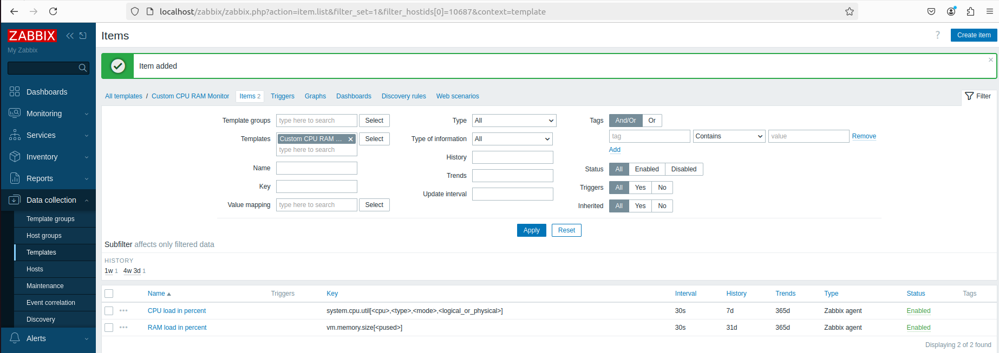

# Домашнее задание: Zabbix

**Фамилия и имя:** Репин Е.Н.

---

## Задание 1. Создание шаблона для мониторинга CPU и RAM

**Название шаблона:** `Custom CPU RAM Monitor`

### Скриншот страницы шаблона

---

## Задание 2-3. Добавление двух хостов и привязка шаблонов

**Имена хостов:** `repinen-1` и `repinen-2`

### Скриншот страницы хостов

---

## Задание 4. Создание кастомного дашборда

**Название дашборда:** `Custom Dashboard - CPU and RAM`

### Скриншот дашборда

